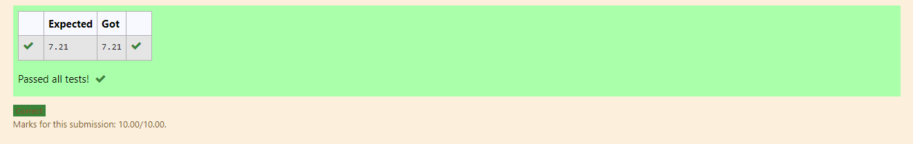

# DISTANCE-BETWEEN-TWO-POINTS

## AIM:
To write a python program to find the distance two  points
## ALGORITHM:
### Step 1: 
Import math library using import statement
### Step 2: 
Define the two points into two separate lists
### Step 3: 
Substitute the values in the distance formula 
### Step 4:
Print the final value rounded upto two decimals using format function. It would display the distance value
### Step 5:
End the program 
### PROGRAM:
~~~
#Program to find the distance between two points.
#Developed by: Kaushika.A
#RegisterNumber: 21500112
import math
l1=[10,6]
l2=[4,2]
dist=math.sqrt(((l1[0]-l2[0])**2)+((l1[1]-l2[1])**2))
print("{:.2f}".format(dist))
~~~

### OUTPUT:

### RESULT:
Thus the python program to find the distance two points is successfully executed.